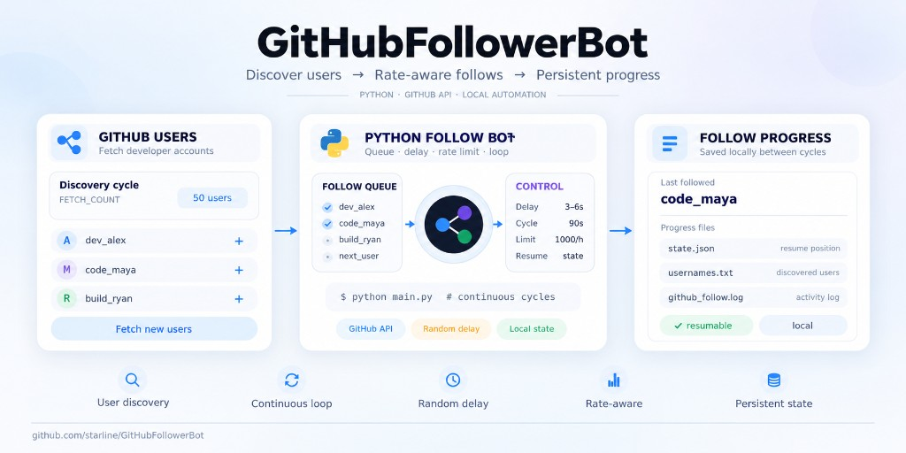

# GitHub Follower Bot

Based on [Github_Automation_Follower_Bot](https://github.com/OfficialCodeVoyage/Github_Automation_Follower_Bot), configured for local use.



## Requirements

- Python 3.10+
- A [classic PAT](https://github.com/settings/tokens) with scopes `read:user` and `user:follow`

## Installation

```bash
cd ~/GitHubFollowerBot
./run.sh
```

On first start the script creates a venv, copies `.env`, and asks for the **GitHub token** if it is empty.

Keep the process running (`tmux`, systemd, …).

### Optional `.env` tweaks

| Variable | Default | Meaning |
|----------|---------|---------|
| `USER_SOURCE` | `cursor` | `cursor` discovery or `random` `/users` stream |
| `BOT_MODE` | `both` | `both` / `discover` (list only) / `follow` |
| `FETCH_COUNT` | `50` | users fetched per cycle (max 100) |
| `FOLLOW_DELAY_MIN` / `MAX` | `3` / `6` | pause between follows (seconds) |
| `LOOP_SLEEP_SECONDS` | `90` | pause between cycles |
| `MAX_CALLS_PER_HOUR` | `1000` | local rate limit |
| `BOT_DATA_DIR` | `./data` | state, queue, logs |

### Cursor discovery

Finds people who mention Cursor / star or contribute to Cursor-related repos / have `.cursorrules`.

| Channel | How |
|---------|-----|
| `users` | Search: `cursor in:bio`, … |
| `repos` | Search Cursor-related repos → owners, enqueue for mining |
| `stargazers` | Stargazers of queued repos |
| `contributors` | Contributors of queued repos |
| `code` | Owners of repos with `.cursorrules` / `.cursor/rules` |

Progress for pages/queues lives in `data/state.json` → `discovery`. List of logins: `data/usernames.txt`.

Only collect the list (no follows):

```bash
# in .env
BOT_MODE=discover
USER_SOURCE=cursor
./run.sh
```

### User filters

| Variable | Default | Meaning |
|----------|---------|---------|
| `FILTER_USERS_ONLY` | `1` | only `type=User` (skip orgs) |
| `FILTER_SKIP_SITE_ADMIN` | `1` | skip site admins |
| `FILTER_SKIP_BOT_LOGINS` | `1` | skip `*[bot]`, `*-bot`, `bot-*` |
| `FILTER_SKIP_ALREADY_FOLLOWING` | `1` | skip if already following |
| `FILTER_ON_FOLLOW` | `1` | re-check queue before follow |
| `MIN_FOLLOWERS` / `MAX_FOLLOWERS` | off | follower count range |
| `MIN_FOLLOWING` / `MAX_FOLLOWING` | off | following count range |
| `MIN_REPOS` / `MAX_REPOS` | off | public repos range |
| `REQUIRE_BIO` / `REQUIRE_LOCATION` / `REQUIRE_HIREABLE` | `0` | require profile fields |
| `LOCATION_CONTAINS` / `LOCATION_EXCLUDE` | off | comma substrings (case-insensitive) |
| `LOGIN_EXCLUDE` | off | exact logins to skip |
| `FILTER_SKIP_DEAD` | `1` | drop inactive / empty accounts |
| `MAX_INACTIVE_DAYS` | `30` | max age of profile update / last public event |
| `FILTER_REQUIRE_PUBLIC_EVENTS` | `1` | require a public event in that window |
| `FILTER_SKIP_EMPTY_PROFILES` | `1` | skip 0 repos + 0 followers |

Dead-user checks load the profile (and usually 1 events call) per candidate.

Profile filters (`MIN_*`, location, bio, …) cost an extra API call per candidate.

Progress is stored under `data/` (`state.json`, `usernames.txt`).

## Project layout

```
GitHubFollowerBot/
├── bot/           # discovery + filters + follow loop
├── data/          # Local state (gitignored)
├── .env.example   # Minimal template (defaults in code)
├── requirements.txt
└── run.sh         # venv + interactive setup + start
```

## Notes

- GitHub rate-limits follow actions; keep delays conservative.
- Automated mass-following may conflict with [GitHub Terms of Service](https://docs.github.com/en/site-policy/github-terms/github-terms-of-service) — use at your own risk.
- Never commit `.env`.
